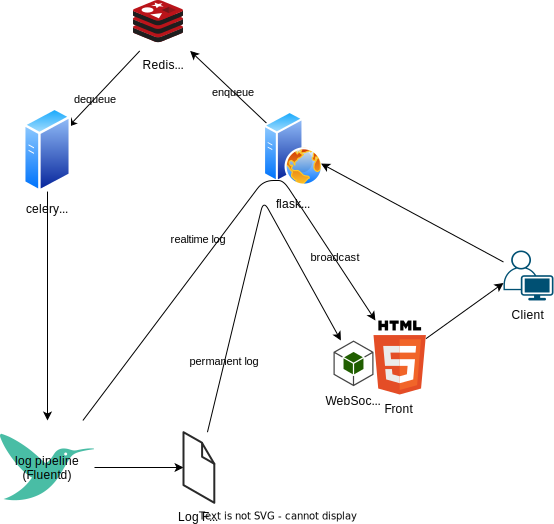

しばしば見る要望 --

- 長時間実行する(例: 機械学習)
- ブラウザ上でタスクをトリガーしたい
- ブラウザ上で進捗や実行結果を見たい

に気づいた。汎用的でシンプルな方法を探索する。探索であって、実運用は考慮されていない。



## 検証

立ち上げる。
```shell
$ docker compose up -d
```

ジョブを投入する。
```shell
$ docker compose exec worker /bin/sh -c 'python -c "from tasks import run; run.delay(\"ls\")"'
```

flowerで投入されているのを確認する。

- localhost:5555

実行ログをキャプチャしているのを確認する。
```shell
$ docker compose logs fluentd -f

joblook-poc-fluentd-1  | {"timestamp":"2024-09-04 13:45:10,123","level":"INFO","message":"hello 1","task_id":"ad4a9d2d-2aa2-43d7-87cd-efa7fc779e69"}
joblook-poc-fluentd-1  | {"timestamp":"2024-09-04 13:45:10,225","level":"INFO","message":"hello 2","task_id":"ad4a9d2d-2aa2-43d7-87cd-efa7fc779e69"}
joblook-poc-fluentd-1  | {"timestamp":"2024-09-04 13:45:10,328","level":"INFO","message":"hello 3","task_id":"ad4a9d2d-2aa2-43d7-87cd-efa7fc779e69"}
joblook-poc-fluentd-1  | {"timestamp":"2024-09-04 13:45:10,431","level":"INFO","message":"hello 4","task_id":"ad4a9d2d-2aa2-43d7-87cd-efa7fc779e69"}
joblook-poc-fluentd-1  | {"timestamp":"2024-09-04 13:45:10,534","level":"INFO","message":"hello 5","task_id":"ad4a9d2d-2aa2-43d7-87cd-efa7fc779e69"}
joblook-poc-fluentd-1  | {"timestamp":"2024-09-04 13:45:10,637","level":"INFO","message":"hello 6","task_id":"ad4a9d2d-2aa2-43d7-87cd-efa7fc779e69"}
joblook-poc-fluentd-1  | {"timestamp":"2024-09-04 13:45:10,740","level":"INFO","message":"hello 7","task_id":"ad4a9d2d-2aa2-43d7-87cd-efa7fc779e69"}
joblook-poc-fluentd-1  | {"timestamp":"2024-09-04 13:45:10,843","level":"INFO","message":"hello 8","task_id":"ad4a9d2d-2aa2-43d7-87cd-efa7fc779e69"}
joblook-poc-fluentd-1  | {"timestamp":"2024-09-04 13:45:10,946","level":"INFO","message":"hello 9","task_id":"ad4a9d2d-2aa2-43d7-87cd-efa7fc779e69"}
joblook-poc-fluentd-1  | {"timestamp":"2024-09-04 13:45:11,048","level":"INFO","message":"hello 10","task_id":"ad4a9d2d-2aa2-43d7-87cd-efa7fc779e69"}
```

## TODO: インターフェース

- タスク投入(command string) -> task_id string
- 永続ログ取得(task_id string) -> log string
- ログ受信およびブロードキャスト(task_id string) -> log string
  - fluentd --リクエスト--> flask
- WebSocket接続(task_id string) -> log string

0. タスクを投入する
  - `curl -X POST -H "Content-Type: application/json" -d "{\"cmd\" : \"ls -al\"}" localhost:8888/enqueue`
0. 永続ログを取得する
  - `curl localhost:8888/permlog?task_id=1d128c57-0066-4e0f-b16f-109d8b8fbb0e`
0. フロントでWebSocket接続する
  - http://localhost:8888/task?task_id=1d128c57-0066-4e0f-b16f-109d8b8fbb0e
0. fluentdがリアルタイムログを送信する
  - `curl -X POST -H "Content-Type: application/json" -d "{\"log\" : \"hello\", \"task_id\": \"1d128c57-0066-4e0f-b16f-109d8b8fbb0e\"}" localhost:8888/sync`
0. WebSocketから受信する
